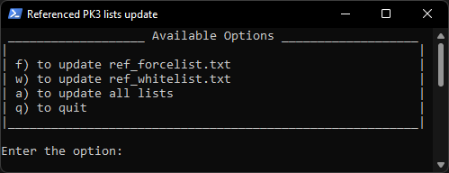

# Referenced PK3 lists

Script for JK2MV referenced pak lists. It reads the contents of a directory filtered by .pk3 extension (excluding some not required) to generate new .txt files using the desired options (all contents or choosen content).